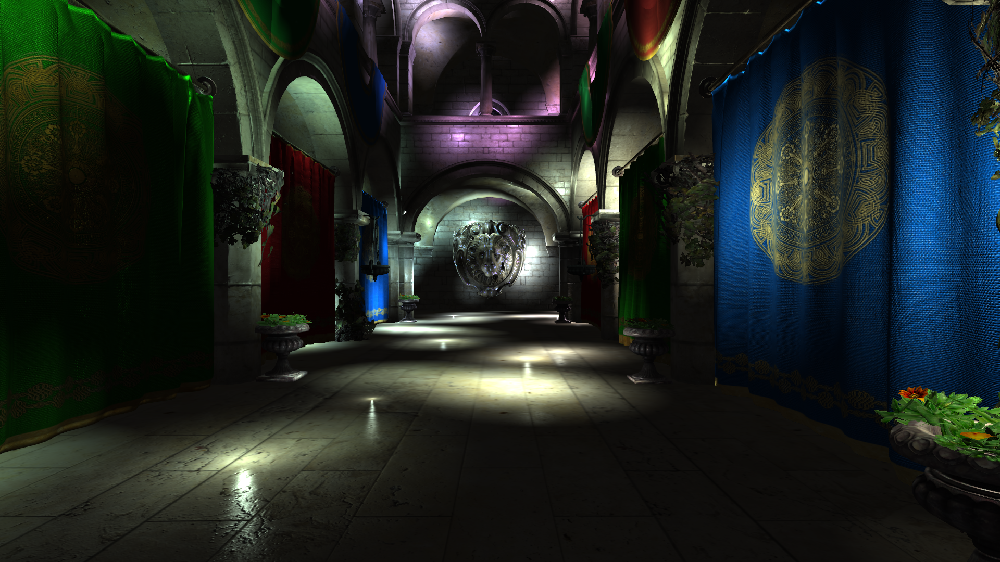
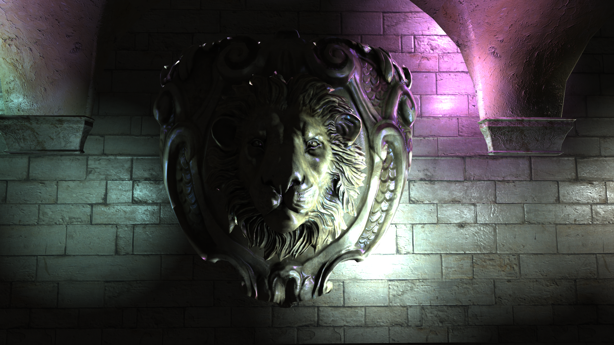
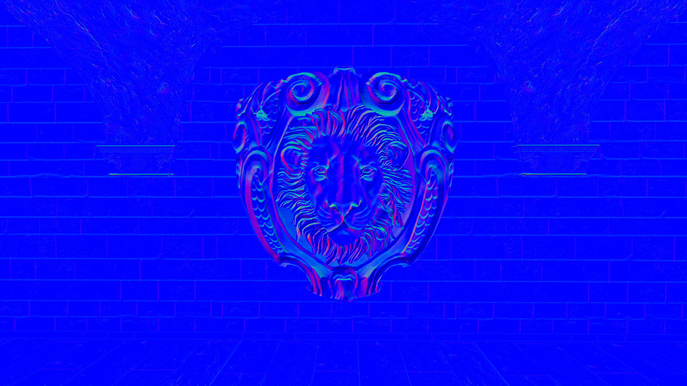
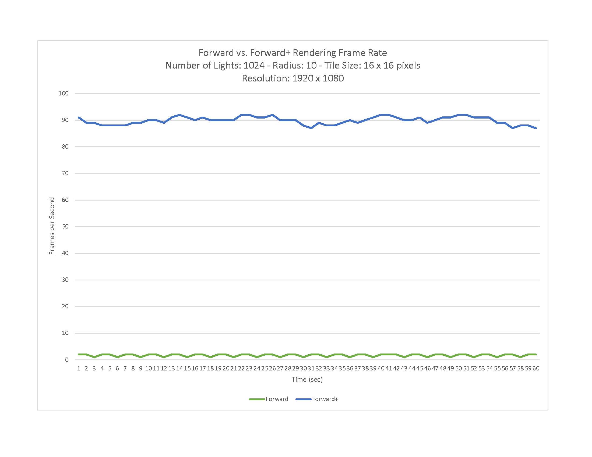
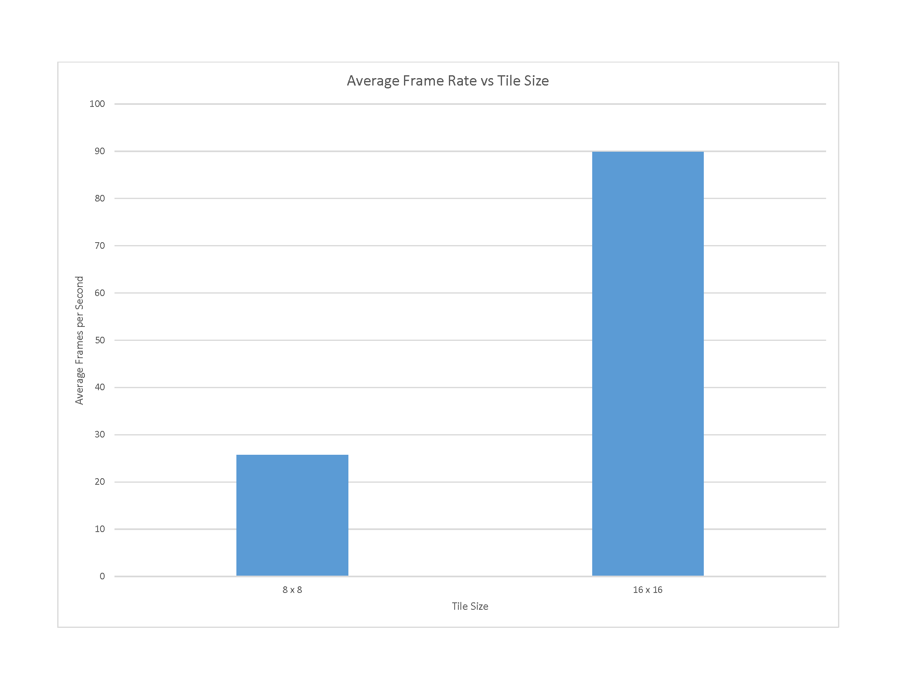
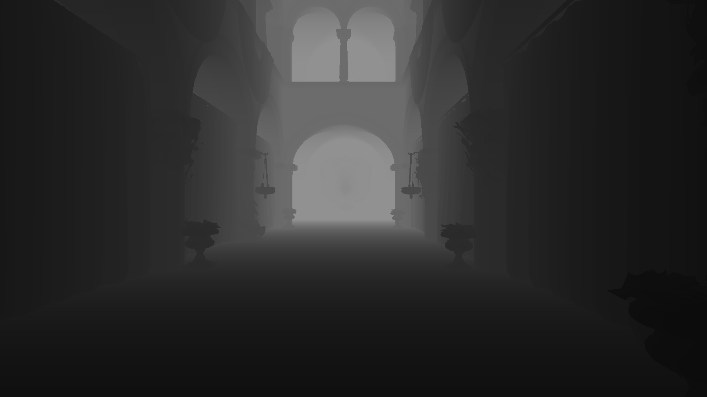

Forward+ Renderer
================

**University of Pennsylvania, CIS 565: GPU Programming and Architecture, Final Project**

* Bradley Crusco
 * [Personal Site](http://www.bradleycrusco.com)
 * [LinkedIn](https://linkedin.com/in/bcrusco)
* Megan Moore
 * [Personal Site](http://momeg0.wix.com/meganemoore)
 * [LinkedIn](https://linkedin.com/in/megan-moore-386076a6)
* Tested on: Windows 10, i7-3770K @ 3.50GHz 16GB, GTX 980 4096MB (Personal Computer)

## Description

TODO

## Video

## Overview

As we learned from the paper, "Forward+: Bringing Deferred Lighting to the Next Level", the three main stages of a Forward+ renderer are the depth prepass, light culling, and the final shading.  These are the three main stages we used in our Farward+ Renderer.  

### Depth Prepass

Starting with the depth prepass, we have a vertex shader that collects the z value of each vertex in the scene.  The fragment shader does not need to do any calculations, as we are not drawing anything to the screen at this time.  We also included a debug view of the depth.  In this view, objects that are closer to the camera are darker, while objects farther away will appear white.  This view can be seen by adding the line "#define DEPTH_DEBUG" at the top of the main.cpp file.  

### Light Culling

Light culling was done in a compute shader.  The compute shader uses a tile based method in order to cull the lights within each tile.  In our demo, we used tiles that were 16 x 16 pixels.  We implemented the gather approach in order to do our light culling, as was discussed in the paper, "Forward+: Bringing Deferred Shading to the Next Level".  In order to implement this approach, created a work group for each tile.  Within that work group, there were 256 threads that used the compute shader, one thread for each pixel in the tile.   The first step in the compute shader was to compute the frustum of the tile.  This was done by finding the minimum and maximum depth values that occurred within the tile, and then based on the work group ID of the tile, we were able to find the sides of the frustrum.  This calculation was done only for the first thread in the work group, since the frustum remains the same for each thread in the tile.    

Once the frustum was calculated, it was time to cull the lights.  The position and radius of each light is passed into the shader through a buffer.  We used this data to calculate the lights distance from the frustum.  If they overlapped, the light was added to the tile's visible light count.  The visible light counts were then passed by a buffer into the final shader.

A debug view of how many lights are in each tile is also provided.  In order to view this, add the line "#define LIGHT_DEBUG" to the top of main.cpp.  The more lights there are in a tile, the lighter it will be.  If there are no lights in a tile, it will be black.  

### Final Shading

For final shader, we passed in the visible light count buffer and diffuse, specular, and normal textures.  We applied blinn-phong lighting to the model.  For each tile, the visibile lights were looped through in order to get the affects of each one in every pixel. This allowed us to create a realistic final fragment color for our rendered image.  

## Features

### Tangent Space Normal Mapping

#### Lion Sculpture Featuring Normal Maps

#### Visualization of Lion Sculpture's Normals

We implemented normal maps in an effort to get better visual fidelity from our scene without to much additional computational cost. Crytek's Sponza model that we are using provided normal maps for most of the objects in the scene, and we created additional ones using Photoshop from the provided diffuse texture maps. We implemented the normal maps using tangent space normal mapping as an optimization over the basic implementation. In this method we express all the normals in our normal map in tangent space, where the vectors point roughly along the positive z direction. We then transform all of our lighting vectors to this coordinate space. This allows us to always use the same normal map regardless of the object's orientation. Above you can see an example of the use of normal maps in our scene.

## Performance Analysis

### Forward+ vs. Forward Rendering Frame Rate

In the a traditional forward renderer, for each fragment we calculate the light contribution from each light in the scene. This is essentially like the culling stage of our Forward+ renderer failing to cull any lights from any of the tiles. We see a massive performance gain when using the Forward+ technique vs. the Forward one. With 1024 lights in the scene (our maximum), a light radius of 10, tile size of 16 pixels squared, and 1080p resolution, we were able to achieve an average framerate of 89.867 frames per second over our 60 second benchmark. Rendering the same scene under the same conditions, Forward rendering only achieved an average of 1.7 frames per second. Below are two videos, one for the Forward renderer and the other for the Forward+, running our benchmark. The Forward+ is able to handle rendering the scene with ease, while the Forward renderer resembles a slide show.

#### Forward vs. Forward+ Rendering Frame Rate

#### Forward Rendering Benchmark (1024 Lights)

#### Forward+ Rendering Benchmark (1024 Lights)

### Tile Size

We experimented with multipe different tile sizes before we landed on 16 x 16 pixel tiles. The most promising canidate was 8 x 8 tiles, and this was also the first size we tried, as it is the size used in the Forward+: Bringing Deferred Lighting to the Next Level paper. With 8 x 8, we achieved an average frame rate of 25.7 frames per second. Once we switched to 16 x 16 pixel tiles, our average jumped to 89.86. You can see those results in the chart below. Below that chart you can see various debug images for different tile dimensions and light sizes. These are the light count debug images. The lighter the tile in the image, the more lights occupy its bounding frustum. The first thing that's clear from these images is the effect of the light radius. At a reasonable light radius of 30, we have a very dark image, and there are very few lights per tile, making our algorithm very efficient at rendering this type of scene. For much larger lights, with a radius of say 50, the Forward+ culling begins to reduce in effectiveness. These these images are much brighter, indicating many more lights per tile than the previous example.

If you look closely at both sets of images you can see the differences between the tile sizes. The 8 x 8 tiles give a more accurate representation of the lighting locations than its 16 x 16 counterpart. However, the additional calculations in the compute shader for the increased number of tiles, among other things, results in diminishing returns. 16 x 16 is by far the best tile size for our scene.

#### Average Frame Rate vs. Tile Size

#### Lights per Tile (1024 Lights, Radius = 30, Tile Size: 8 x 8)

.png "Lights per Tile (1024 Lights, Radius = 30, Tile Size = 8 x 8)")

#### Lights per Tile (1024 Lights, Radius = 30, Tile Size: 16 x 16)

.png "Lights per Tile (1024 Lights, Radius = 30, Tile Size = 16 x 16)")

#### Lights per Tile (1024 Lights, Radius = 50, Tile Size: 8 x 8)

.png "Lights per Tile (1024 Lights, Radius = 50, Tile Size = 8 x 8)")

#### Lights per Tile (1024 Lights, Radius = 50, Tile Size: 16 x 16)

.png "Lights per Tile (1024 Lights, Radius = 50, Tile Size = 16 x 16)")

## Additional Debug Images

### Depth Buffer

## Future Work

We had a lot of fun working on this project and are really excited with the results we achieved. Because of the time constraints of the project we were forced to focus all of our attention on the main implementation of the Forward+ technique. We think there's a lot more that could be done to improve the quality and performance of the renderer, and we have lots of plans for future development.

* Directional lights
* Material properties
* Stenciled shadow volumes for point lights
* SSAO
* Gamma correction
* Cascading shadow maps
* Skybox and environment mapping
* Improved normal mapping techniques
* High dynamic range lighting
* Bloom
* Visual representations of the point lights in the scene

## Build Instructions

Coming soon.

## Interactive Controls

Controlling the camera and moving about the scene will be intuitive to anyone whose played a first-person shooter game.
* W: Move forward.
* A: Move left.
* S: Move backward.
* D: More right.
* Mouse movement: Orients the camera.

## Acknowledgements
* [Forward+: Bringing Deferred Rendering to the Next Level](https://takahiroharada.files.wordpress.com/2015/04/forward_plus.pdf)
 * Takahiro Harada, Jay McKee, and Jason C.Yang
 * [EUROGRAPHICS 2012 Slide Deck](http://www.slideshare.net/takahiroharada/forward-34779335)
* [DirectX 11 Rendering in Battlefield 3](http://www.dice.se/news/directx-11-rendering-battlefield-3/)
 * Johan Andersson
 * Helpful in resolving some of the light culling implementation details.
* [Learn OpenGL](http://www.learnopengl.com/)
 * Joey de Vries
 * Helped with clarification on OpenGL implementation details and basis for our model loader.
 * Thanks to [Debanshu Singh](https://www.linkedin.com/in/debanshu) for introducing this to us.
* [Crytek's Sponza Model](http://www.crytek.com/cryengine/cryengine3/downloads)
 * Frank Meinl
 * Have made changes to remove certain parts of the scene, create additional normal and specular maps, etc.

## Libraries
* [Assimp: Open Asset Import Library](http://www.assimp.org/)
 * Used to load our assets into the renderer.
* [DevIL: Developer's Image Library](http://openil.sourceforge.net/)
 * Used for loading images for textures.
